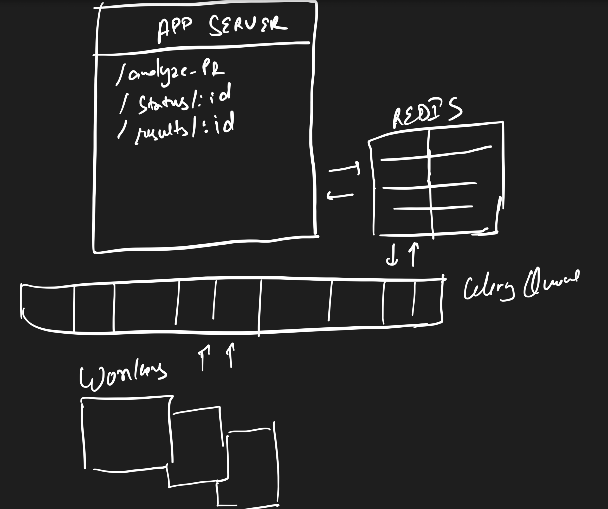

# koffee

You can go grab a coffee and this tool will review your PRs for you.

# Routes

POST ```/analyze-pr```

> Request

```
{
  "repo_url": "https://github.com/potpie-ai/potpie",
  "pr_number": 189
}
```

> Response

```
{
  "job_id": "d54c7f7e-3870-4ee2-9dae-490481c5213d",
  "success": true
}
```
#
GET ```/status/<task_id>```

> Response

```
{
  "job_id": "d54c7f7e-3870-4ee2-9dae-490481c5213d",
  "status": "successful"
}
```
#
GET ```/results/<task_id>```

> Response

```
{
   "job_id":"3487cc95-b939-46bb-90c8-1b728a454384",
   "status":"successful",
   "results":[
      {
         "files":[
            {
               "name":"potpie/core/model.py",
               "issues":[
                  {
                     "type":"style",
                     "line":20,
                     "description":"Missing docstrings.",
                     "suggestion":"Add comprehensive docstrings explaining the purpose and usage of the `Model`"
                  },
                  {
                     "type":"best practice",
                     "line":52,
                     "description":"Directly modifying the global `settings`.",
                     "suggestion":"Consider using a more structured approach for managing settings, such as a dedicated settings module or class."
                  },
                  {
                     "type":"best practice",
                     "line":67,
                     "description":"The `generate` method lacks proper error handling.",
                     "suggestion":"Implement appropriate `try-except` blocks to handle potential exceptions during generation."
                  }
               ]
            }
         ],
         "summary":{
            "total_files":3,
            "total_issues":7,
            "critical_issues":0
         }
      }
   ]
}
```

## Design decisions

Simple and scaleable design 



* Used redis for storing status and results

* Celery for queueing

## Future improvements
 
* Database to start with

* Support for private repos

* Auth Support

* Rate Limiting